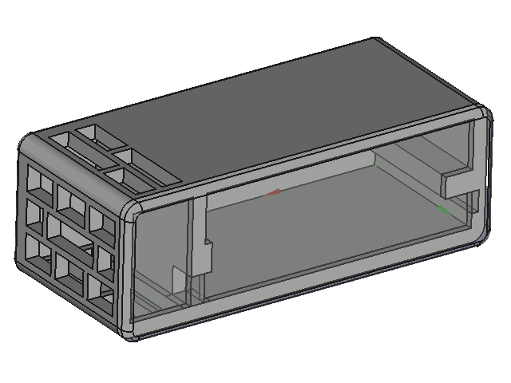
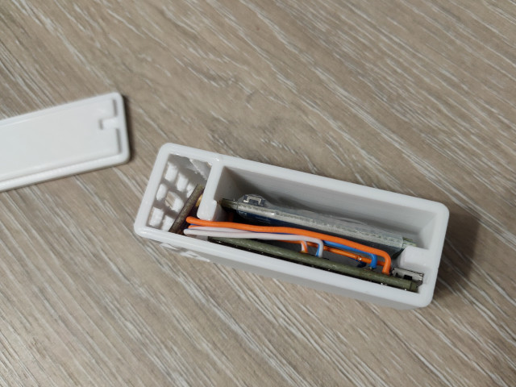

# Content

* `temperature_sensor_body.stl` - FreeCAD case model with boxes for STM32G030, JDY-34 and BME boards;
* `temperature_sensor.FCStd` and `temperature_sensor_cap.stl` - meshes for case. Meshed are ready to import to slicer.

This model created for development board with STM32G030F6P6 microcontroller, JDY-34 DIP board and BME280 6-PIN board.
All components can be placed in case from bottom to up side:

Components from bottom to top: STM32G030F6P6 development board, JDY-34 board, BME280 sensor board.
